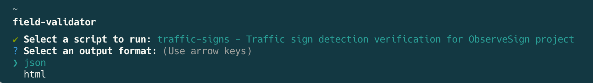

# Field Validator CLI

A command-line interface tool was built for validating annotations for the field engineering team

## Documentation

- [Getting Started](./docs/getting-started.md)
- [API reference](./docs/api-reference.md)
- [Goals and Next Steps](./docs/goals-and-next-steps.md)
- [Contributing](./docs/CONTRIBUTING.md)
- [Challenge](./docs/CHALLENGE.md)

## Features

- Validate annotations against predefined modular rules
- Multiple output formats (JSON, HTML)
- Interactive CLI menu for script selection
- Support for output piped operations
- Pagination support for large datasets based on generator functions
- Highly scalable and modular design

## Project Structure

- `/src`: Source code
  - `/cli`: CLI-related functionality
  - `/core`: Core validation logic shared by all scripts
  - `/lib`: Shared utilities and interfaces
  - `/scripts`: Individual validation scripts
- `/tests`: Unit tests and mocks
- `/docs`: Documentation
- `/bin`: Executable files (not tracked)
- `/results`: Results output directory (not tracked)
